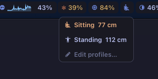

<p align="center">
  
</p>

<h1 align="center">DeskFlow</h1>

<p align="center">
  <strong>Control your IKEA IDÅSEN standing desk from SketchyBar, with a small profile editor for your Mac</strong>
</p>

<p align="center">
  <a href="#how-it-works">How it works</a> •
  <a href="#screenshots">Screenshots</a> •
  <a href="#installation">Installation</a> •
  <a href="#usage">Usage</a> •
  <a href="#profiles-file">Profiles file</a> •
  <a href="#alternatives">Alternatives</a>
</p>

---

## How it works

The desk accepts one Bluetooth connection at a time. A headless provider holds that connection permanently. Everything else talks to the provider.

```
           BLE notifications (height)
IDÅSEN  ─────────────────────────────▶  desk_provider  ── desk_update ──▶  SketchyBar item + popup
        ◀─────────────────────────────  (always on, ~3 MB)
           BLE commands (move)              ▲      │
                                            │      └── ~/.cache/sketchybar/desk.state
                       goto / nudge / stop  │                  │
                ~/.cache/sketchybar/desk.fifo                  ▼
                                            └──────────  DeskFlow.app (only while open)
                                                         edits ~/.config/sketchybar/desk_profiles
```

| Part | Where | Role |
|---|---|---|
| `desk_provider` | `~/.config/sketchybar/helpers/event_providers/desk/` | Swift, Foundation and CoreBluetooth only. Gets the height from notifications, with no polling. Moves the desk on `goto`, `nudge` and `stop`. |
| SketchyBar item | `~/.config/sketchybar/plugins/desk.sh` | Shows the active profile's icon. The popup lists the profiles, a Stop row while the desk moves, and **Edit profiles…**. |
| DeskFlow | `DeskFlow/` in this repo | On-demand SwiftUI editor: live height, ±1 cm, exact height, and profile management. It quits when you close its window. |

The provider and the SketchyBar plugin live in the SketchyBar config, not in this repo.

## Screenshots

<p align="center">
  
</p>

<p align="center">
  <em>The bar shows the active profile's icon; the popup moves the desk</em>
</p>

<p align="center">
  
</p>

<p align="center">
  <em>DeskFlow: live height, fine controls and profiles</em>
</p>

## Installation

### Requirements

- macOS 14.0 or later
- An IKEA IDÅSEN desk with Bluetooth
- [SketchyBar](https://github.com/FelixKratz/SketchyBar) running the desk provider and plugin
- The `MesloLGS NF` Nerd Font, for the profile icons
- The Xcode Command Line Tools. Full Xcode is not needed.

### Build DeskFlow

```bash
cd DeskFlow
make install
```

This builds `DeskFlow.app` with `swiftc` and installs it in `~/Applications`. The SketchyBar popup opens it with `open -b com.deskflow.app`.

The app uses `@ViewState`, an alias of `SwiftUI.State`, instead of `@State`. In the macOS 27 SDK, `@State` is a macro whose plugin ships only with Xcode.

`DeskFlow.xcodeproj` still builds the same sources if you have Xcode.

## Usage

- **Switch profiles:** click the desk icon in SketchyBar, then click a profile.
- **Stop:** the popup shows Stop while the desk moves.
- **Fine-tune:** choose **Edit profiles…** to open DeskFlow.

| Action in DeskFlow | Shortcut |
|---|---|
| Move 1 cm up or down | ⌘↑ / ⌘↓ |
| Go to the typed height | Return in the height field |
| Stop | ⌘. |
| New profile | ⌘N |
| Edit the selected profile | Return |
| Delete the selected profile | Delete |
| Cancel an edit | Esc |

Every save updates the SketchyBar popup at once. If the window shows **Provider not running**, the profiles can still be edited, but the desk cannot move.

## Profiles file

DeskFlow and the SketchyBar plugin share `~/.config/sketchybar/desk_profiles`. Each line is one profile:

```
Sitting | 77 | 󰒂
Standing | 112 | 󰋦
```

- The fields are name, height in cm (decimals allowed), and a single Nerd Font glyph.
- The legacy format `Sitting 77` still works and uses the default icon.
- Lines starting with `#` and blank lines are kept.
- A hand edit refreshes DeskFlow. Run `~/.config/sketchybar/plugins/desk.sh rebuild` or `sketchybar --reload` to refresh the popup.

## Compatibility

DeskFlow works with **IKEA IDÅSEN** sit/stand desks that have Bluetooth (the ones whose physical controller has up/down memory buttons). The provider speaks the LINAK DPG1C protocol over Bluetooth LE.

## Alternatives

### Python CLI

The [Python CLI tool](python-cli/) controls the desk from the terminal:

```bash
cd python-cli
uv sync
uv run python idasen_controller.py sit
uv run python idasen_controller.py stand
uv run python idasen_controller.py move 0.85
```

The desk accepts one Bluetooth connection, so stop `desk_provider` before you use the CLI. See [python-cli/README.md](python-cli/README.md) for full documentation.

## Credits

Protocol information reverse-engineered by the community:
- [newAM/idasen](https://github.com/newAM/idasen)
- [rhyst/linak-controller](https://github.com/rhyst/linak-controller)

## License

MIT License — feel free to use, modify, and distribute.
