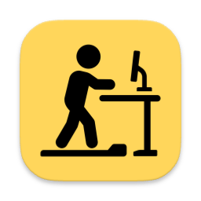
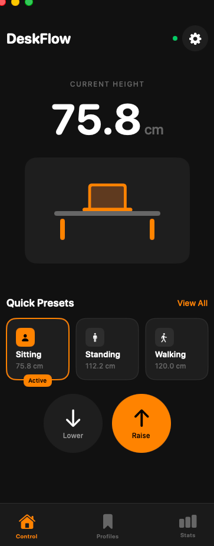
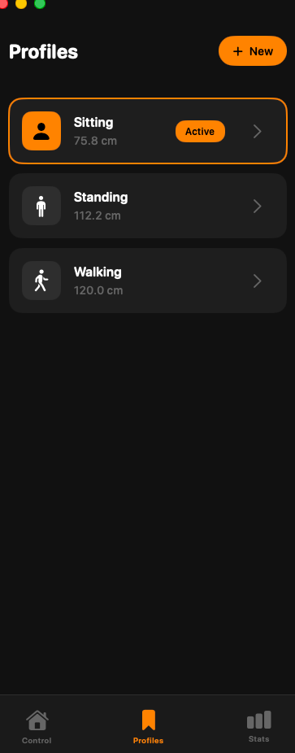
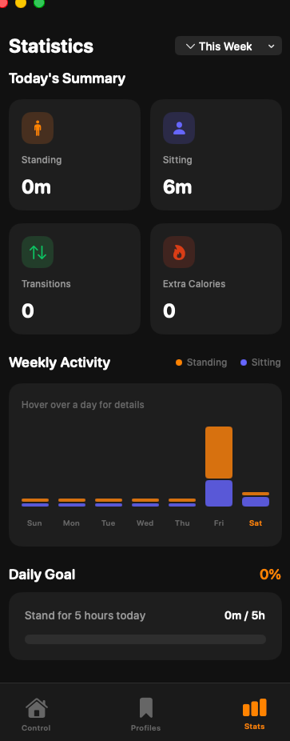

<p align="center">
  
</p>

<h1 align="center">DeskFlow</h1>

<p align="center">
  <strong>Control your IKEA IDÅSEN standing desk from your Mac</strong>
</p>

<p align="center">
  <a href="#features">Features</a> •
  <a href="#screenshots">Screenshots</a> •
  <a href="#installation">Installation</a> •
  <a href="#usage">Usage</a> •
  <a href="#alternatives">Alternatives</a>
</p>

---

## Features

- **Bluetooth Control** — Connect directly to your IKEA IDÅSEN desk via Bluetooth LE
- **Height Presets** — Save and quickly switch between your favorite positions (sitting, standing, walking)
- **Real-time Display** — See your current desk height with a visual representation
- **Usage Statistics** — Track your standing vs sitting time with daily and weekly charts
- **Menu Bar App** — Lives in your menu bar for quick access without cluttering your dock
- **Daily Goals** — Set standing goals and track your progress

## Screenshots

<p align="center">
  
  &nbsp;&nbsp;
  
  &nbsp;&nbsp;
  
</p>

<p align="center">
  <em>Control • Profiles • Statistics</em>
</p>

## Installation

### Requirements

- macOS 13.0 or later
- IKEA IDÅSEN desk with Bluetooth connectivity
- Bluetooth enabled on your Mac

### Download

Download the latest release from the [Releases](../../releases) page.

### Build from Source

```bash
git clone https://github.com/yourusername/DeskFlow.git
cd DeskFlow/DeskFlow
open DeskFlow.xcodeproj
```

Build and run with Xcode (⌘R).

## Usage

1. **Connect** — Launch DeskFlow and it will automatically search for your IDÅSEN desk
2. **Control** — Use the up/down buttons or click a preset to move your desk
3. **Customize** — Create profiles for your preferred heights (sitting, standing, treadmill, etc.)
4. **Track** — Monitor your standing habits in the Statistics tab

### Menu Bar

DeskFlow lives in your menu bar when the main window is closed. Click the icon to:
- See your current height
- Quick-switch between presets
- Access the full app

## Compatibility

DeskFlow works with **IKEA IDÅSEN** sit/stand desks that have Bluetooth connectivity (the desks with the physical controller that has up/down memory buttons).

The app communicates via Bluetooth LE using the LINAK DPG1C protocol.

## Alternatives

### Python CLI

Prefer the command line? Check out the [Python CLI tool](python-cli/) for terminal-based control:

```bash
cd python-cli
uv sync
uv run python idasen_controller.py sit
uv run python idasen_controller.py stand
uv run python idasen_controller.py move 0.85
```

See [python-cli/README.md](python-cli/README.md) for full documentation.

## Credits

Protocol information reverse-engineered by the community:
- [newAM/idasen](https://github.com/newAM/idasen)
- [rhyst/linak-controller](https://github.com/rhyst/linak-controller)

## License

MIT License — feel free to use, modify, and distribute.

---

<p align="center">
  Made with ☕ for healthier work habits
</p>
